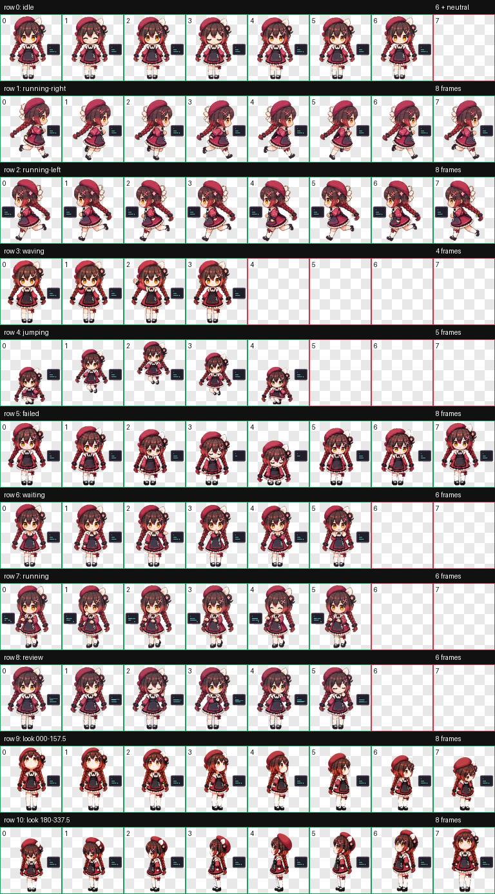

<p align="center">
  
</p>

<h1 align="center">Joi</h1>

<p align="center">
  <strong>VirtuaReal 所属のバーチャルライバー Joi をモチーフにした、非公式・非商用の Codex ピクセルデスクトップペットです。</strong>
</p>

<p align="center">
  <a href="./README.en.md">English</a> ·
  <a href="./README.md">简体中文</a> ·
  <strong>日本語</strong> ·
  <a href="./README.ko.md">한국어</a> ·
  <a href="./README.fr.md">Français</a>
</p>

<p align="center">
  
  
  <a href="https://space.bilibili.com/61639371"></a>
</p>

<p align="center">
  
  
  <a href="./LICENSE.md"></a>
  
</p>

<p align="center">
  <a href="#overview">概要</a> ·
  <a href="#actions">アクション</a> ·
  <a href="#specification">仕様</a> ·
  <a href="#installation">インストール</a> ·
  <a href="#license">ライセンス</a> ·
  <a href="#review">レビュー</a>
</p>

---

<a id="overview"></a>

## 概要

Joi は、中国の動画プラットフォーム Bilibili で活動し、バーチャルアーティストグループ VirtuaReal に所属するバーチャルライバーです。

ピクセルアート、サイバーパンク、映画『ブレードランナー』が好きで、運動は嫌いです。特技は「ミカンを一口で一個食べられる」ことで、ミカンを最も完璧な果物だと考えています。ミカンの「🍊」は、非公式ながら Joi を表す事実上の絵文字にもなっています。[Joi_Channel の Bilibili プロフィール](https://space.bilibili.com/61639371)もぜひご覧ください。

| Codex Pet | 標準アニメーション | 視線方向 | セル |
| :---: | :---: | :---: | :---: |
| `v2` | `9` | `16` | `192×208` |

> [!IMPORTANT]
> 本リポジトリは、Joi をモチーフにファンが独立して制作した非公式・非商用の Codex デスクトップペットであり、Joi、VirtuaReal、Bilibili またはその他の関係権利者による公式作品、提携、許諾、スポンサー提供を示すものではありません。

<a id="actions"></a>

## アクションプレビュー

<table>
  <tr>
    <td align="center" width="33%">
      <br>
      <strong>待機</strong><br><code>idle</code>
    </td>
    <td align="center" width="33%">
      <br>
      <strong>右へ移動</strong><br><code>running-right</code>
    </td>
    <td align="center" width="33%">
      <br>
      <strong>左へ移動</strong><br><code>running-left</code>
    </td>
  </tr>
  <tr>
    <td align="center">
      <br>
      <strong>手を振る</strong><br><code>waving</code>
    </td>
    <td align="center">
      <br>
      <strong>ジャンプ</strong><br><code>jumping</code>
    </td>
    <td align="center">
      <br>
      <strong>失敗フィードバック</strong><br><code>failed</code>
    </td>
  </tr>
  <tr>
    <td align="center">
      <br>
      <strong>入力待ち</strong><br><code>waiting</code>
    </td>
    <td align="center">
      <br>
      <strong>タスク実行</strong><br><code>running</code>
    </td>
    <td align="center">
      <br>
      <strong>結果レビュー</strong><br><code>review</code>
    </td>
  </tr>
</table>

<details>
<summary><strong>完全な 8×11 アクション一覧を表示</strong></summary>

<p align="center">
  
</p>

</details>

<details>
<summary><strong>フレーム数、タイミング、プロトコル行の詳細を表示</strong></summary>

| 行 | ステート | フレーム数とタイミング | 動作 |
| ---: | --- | --- | --- |
| 0 | `idle` 待機 | 6フレーム；`280 / 110 / 110 / 140 / 140 / 320 ms` | わずかな呼吸、まばたき、自然な重心移動。控えめながら静止画ではなく、デフォルト状態や動きを抑えた表示の先頭フレームに適しています。 |
| 1 | `running-right` 右へ移動 | 8フレーム；最初の7フレームは約 `120 ms`、最後は `220 ms` | 画面右を向いて進みます。交互に運ぶ足に合わせて、スカートと三つ編みがリズミカルに揺れます。 |
| 2 | `running-left` 左へ移動 | 8フレーム；最初の7フレームは約 `120 ms`、最後は `220 ms` | 画面左を向いて進みます。足取りに合わせて髪と衣装が揺れ、右移動とは異なる横顔を見せます。 |
| 3 | `waving` 手を振る | 4フレーム；最初の3フレームは約 `140 ms`、最後は `280 ms` | 自然な立ち姿から手を上げて挨拶し、滑らかに開始姿勢へ戻ります。 |
| 4 | `jumping` ジャンプ | 5フレーム；最初の4フレームは約 `140 ms`、最後は `280 ms` | 踏み込み、離地、頂点、下降、着地を順に描き、体の高さと姿勢の変化で弾む動きを表現します。 |
| 5 | `failed` 失敗フィードバック | 8フレーム；最初の7フレームは約 `140 ms`、最後は `240 ms` | 落ち込んだ表情から、はっきりとした沈み込みと体を縮める姿勢へ移り、再び作業を続けられる状態へ戻ります。失敗、キャンセル、ブロック時のフィードバックに使用します。 |
| 6 | `waiting` 入力待ち | 6フレーム；最初の5フレームは約 `150 ms`、最後は `260 ms` | 期待や問いかけを感じさせる視線と手の動きで、「承認、支援、またはユーザー入力が必要」であることを示します。通常の待機やレビュー状態とは明確に区別されます。 |
| 7 | `running` タスク実行 | 6フレーム；最初の5フレームは約 `120 ms`、最後は `220 ms` | 固定サイズの端末が身体に接続されない独立した浮遊状態と同じ外形を保ち、Joiは端末に向かって空中入力します。変化するのは画面内のシアンのコードだけで、展開・収納・キーボード化はありません。 |
| 8 | `review` 結果レビュー | 6フレーム；最初の5フレームは約 `150 ms`、最後は `280 ms` | 同じ固定サイズの端末が身体に接続されない独立した浮遊状態と外形を保ち、Joiはジェスチャーで内容を確認します。動くのは画面内のシアンのスキャンラインだけで、視線・頭・上半身が走査位置を追ってから滑らかにループへ戻ります。 |
| 9 | `look A` 上から右下 | 8方向 | `000 → 022.5 → 045 → 067.5 → 090 → 112.5 → 135 → 157.5`；上方から画面右を経て右下へ、視線が連続して移ります。 |
| 10 | `look B` 下から左上 | 8方向 | `180 → 202.5 → 225 → 247.5 → 270 → 292.5 → 315 → 337.5`；下方から画面左を経て左上へ、視線が連続して移ります。 |

</details>

<a id="specification"></a>

## アセット仕様

| 項目 | 値 |
| --- | --- |
| Pet ID | `joi` |
| この日本語版での名称 | `Joi` |
| ローカライズ | 簡体中国語版のみローカライズされた表示名を使用 |
| スプライトバージョン | `spriteVersionNumber: 2` |
| アトラス | `1536×2288` WebP、透明背景 |
| グリッド | 8列 × 11行 |
| セル | `192×208` |
| 標準アニメーション | 9行 |
| 視線方向 | 16方向 |
| 作品の位置づけ | 非公式ファン作品 |
| ライセンス | 非商用利用のみ |
| ローカルインストール先 | `~/.codex/pets/joi/` |

**ファイル：** [`pet.json`](./pet/pet.json) · [`spritesheet.webp`](./pet/spritesheet.webp) · [GitHub Release パッケージ](https://github.com/tpmoonchefryan/joi-channel-codex-hatch-pet/releases/latest/download/joi-pet.zip) · [ライセンス](./LICENSE.md)

<details>
<summary><strong>リポジトリ構成と命名規約を表示</strong></summary>

```text
joi-channel-codex-hatch-pet/
├── README.md
├── README.en.md
├── README.ja.md
├── README.ko.md
├── README.fr.md
├── LICENSE.md
├── THIRD_PARTY_NOTICES.md
├── pet/
│   ├── pet.json
│   └── spritesheet.webp
└── assets/
    ├── contact-sheet.png
    └── previews/
```

- この日本語版では `Joi`
- English / 한국어 / Français でも `Joi`
- 簡体中国語版のみローカライズされた表示名を使用
- プログラムおよびディレクトリの識別子：`joi`
- リポジトリ名：`joi-channel-codex-hatch-pet`

</details>

<a id="installation"></a>

## ローカルインストール

リポジトリのルートディレクトリで次を実行します。

```bash
PET_DIR="${CODEX_HOME:-$HOME/.codex}/pets/joi"
mkdir -p "$PET_DIR"
cp pet/pet.json pet/spritesheet.webp "$PET_DIR/"
```

> [!TIP]
> 最新の `joi-pet.zip` は [GitHub Releases](https://github.com/tpmoonchefryan/joi-channel-codex-hatch-pet/releases/latest) からダウンロードしてください。リポジトリが非公開の間は、許可された GitHub アカウントのみダウンロードできます。展開後、`pet.json` と `spritesheet.webp` を一緒に `~/.codex/pets/joi/` へ配置し、`spriteVersionNumber: 2` を保持してください。

<a id="license"></a>

## ライセンスと権利

> [!WARNING]
> 本作品は非公式・非商用のファン作品であり、個人による非商用利用に限られます。販売、有料配布、収益化、商用サービスへの組み込み、ブロックチェーン用途、および公式の許諾や推奨があると誤認させる行為は禁止されています。

<details>
<summary><strong>禁止される利用範囲の概要を表示</strong></summary>

- 販売、有料ダウンロード、有料配布、購読者または会員限定での提供；
- 広告、スポンサー、商用プロモーション、その他の収益化；
- 商用ソフトウェア、顧客向け案件、有料サービス、商用製品への組み込みや同梱；
- NFT、デジタルコレクティブル、トークンその他のブロックチェーン用途；
- 公式作品を装うこと、または Joi、VirtuaReal、Bilibili その他の権利者による許諾、承認、推奨があると示唆すること。

</details>

Joi の名称、キャラクター像、設定、ならびに VirtuaReal、Bilibili その他の第三者に属する名称、商標、素材等の権利は、それぞれの正当な権利者に留保されます。本リポジトリのライセンスは、それら第三者の権利を付与するものではありません。詳細は [`LICENSE.md`](./LICENSE.md) と [`THIRD_PARTY_NOTICES.md`](./THIRD_PARTY_NOTICES.md) を参照してください。

<a id="review"></a>

## レビュー状況

> [!NOTE]
> 本リポジトリは引き続き所有者レビュー用の非公開リポジトリです。インストールパッケージは [GitHub Releases](https://github.com/tpmoonchefryan/joi-channel-codex-hatch-pet/releases) で配布し、Git 内の `release/` ディレクトリは廃止しました。Release の公開範囲はリポジトリに従い、所有者が明示的に承認するまで Public には切り替えません。

- [x] デスクトップペットのアセットとインストールパッケージを整理済み
- [x] README と多言語ドキュメントを作成済み
- [x] GitHub の非公開リポジトリへプッシュ済み
- [x] インストールパッケージを GitHub Releases へ移行済み
- [ ] 所有者による公開レビューの完了
- [ ] Public への切り替え

---

<p align="center">
  <sub>Unofficial fan project · Non-commercial only · Private review</sub>
</p>
